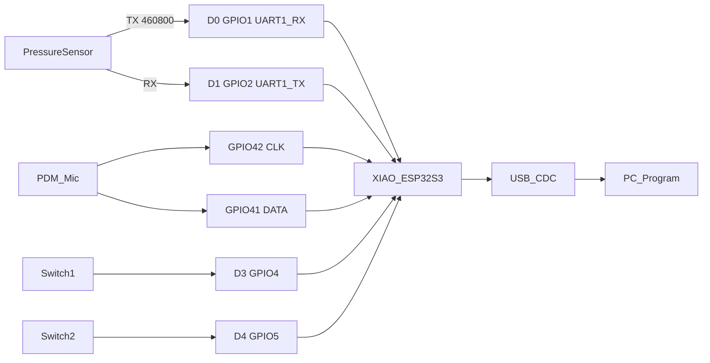

# XIAO ESP32-S3 传感器/音频/开关 USB 透传方案

## 目标与边界

固件只做三件事：实时收齐压力传感器 70 字节帧并校验后透传、持续采集板载 PDM 麦克风、上报两个触点开关状态。三路数据复用 **一条 USB CDC**，由 PC 程序按协议解包。

本阶段不做：摄像头初始化、SD 卡录音/存盘、WiFi。SD 占用 D8/D9/D10 和 GPIO21，与本次功能无冲突，留作后续扩展。

工程形态：仓库根目录新建 PlatformIO 工程（`platformio.ini` + `src/`），板型 `seeed_xiao_esp32s3`（已带 PSRAM、`ARDUINO_USB_CDC_ON_BOOT`）。另附一个最小 Python 解包脚本，方便联调，不是业务程序本身。

## 硬件与引脚

确认 Sense 扩展板就是带 PDM 麦、SD 槽、摄像头排座的那块。摄像头未插不影响本次接线；**不要动扩展板背面 J1/J2**（剪断后麦克风失效）。D11/D12 与麦克风复用，禁止当开关脚。

接线约定：

- 传感器 TX → XIAO **D0 (GPIO1)**，传感器 RX → XIAO **D1 (GPIO2)**。固件：`Serial1.begin(460800, SERIAL_8N1, D0, D1)`。
- 麦克风：官方 PDM，`I2S.setPinsPdmRx(42, 41)`，16 kHz / 16-bit / 单声道。
- 开关 SW1 = **D3/GPIO4**，SW2 = **D4/GPIO5**。`INPUT_PULLUP`，另一端接 **GND**。闭合=低电平=按下。未接线时两路恒为断开（高），固件仍可跑。
- 避开：D0/D1（传感器）、D8/D9/D10（SD SPI）、GPIO41/42（麦）、GPIO21（板载 LED，且与 SD CS 复用）。D2/GPIO3 是 JTAG/strapping，不用。

电气注意：XIAO UART 为 **3.3V**。若传感器 TX 是 5V，必须加电平转换，否则可能损坏芯片。传感器 RX 已接 D1，当前协议图只有采集器上发、无下行命令，TX 先空闲初始化，便于以后补配置帧。

开关建议：干接点、就近 GND、短线；必要时脚上再加 100nF 到地。软件做 20–30 ms 去抖。

## 传感器帧（按定义图实现）

70 字节、20 FPS、`8N1`、460800：

- `[0..1]` 头：`0xFF 0x84`
- `[2..3]` `CNT_H CNT_L`，每帧 +1 的 16 位计数
- `[4..67]` 32 点 × 2 字节：`X0Y0` … `X7Y3`（8×4）。每点 11-bit ADC：高字节仅低 3 位有效，低字节 8 位
- `[68..69]` `Checksum_H Checksum_L`

校验：`sum = CNT_H + CNT_L + 64 字节坐标`（不含头、不含校验本身），`Checksum_H = (sum >> 8) & 0xFF`，`Checksum_L = sum & 0xFF`。累加用 32 位再取低 16 位。

收包策略：在 UART1 字节流里搜 `0xFF 0x84`，再读满 68 字节；校验失败则从缓冲里重新搜头，不把坏帧当有效透传。RX 缓冲至少 1KB。MCU **不解析坐标网格**，只组帧+校验，70 字节原样放进 USB 包（真正透传）。

## USB 复用协议

`Serial` 走原生 USB CDC。音频约 32 KB/s、传感器约 1.4 KB/s，USB 带宽足够，但不能把 PCM 和 70 字节帧直接混进同一字节流，必须组包。

每包：

- 魔数 2 字节：`0xA5 0x5A`
- 类型 1 字节
- 长度 2 字节小端
- 载荷
- CRC16-CCITT（类型+长度+载荷，小端）

类型：

- `0x01` 传感器：载荷 = 原始 70 字节
- `0x02` 音频：载荷 = `int16` 小端 PCM，16 kHz 单声道；块长 **320 sample / 640 字节（20 ms）**，与 20 FPS 对齐
- `0x03` 开关：1 字节，`bit0=SW1`，`bit1=SW2`，`1` = 闭合。变化立即发，另每 200 ms 心跳再发一次，避免主机以为掉线
- `0x04` 状态（低优先级）：丢包/校验失败计数，便于联调

丢包策略：USB 写不动时 **先丢音频、保传感器和开关**。主机用魔数+长度+CRC 失步重同步。

## 固件结构

FreeRTOS 三任务 + 一个 USB 写出队列（队列只放小描述符，大音频块用环形缓冲）：

- `sensor_task`：UART 组帧、校验、入队 `0x01`
- `audio_task`：I2S/PDM 读 20 ms PCM、入队 `0x02`
- `io_task`：去抖开关，变化/`0x03` 心跳，可选 `0x04`
- `usb_task`：按优先级从队列取包，组帧写 `Serial`

主要文件：

- `[platformio.ini](platformio.ini)`：`board = seeed_xiao_esp32s3`，`framework = arduino`
- `[src/main.cpp](src/main.cpp)`：初始化 USB、UART1、I2S、GPIO、建任务
- `[src/protocol.h](src/protocol.h)`：魔数、类型、CRC
- `[src/sensor_uart.cpp](src/sensor_uart.cpp)`：搜头、70 字节、校验
- `[src/audio_i2s.cpp](src/audio_i2s.cpp)`：PDM 16 kHz
- `[src/switches.cpp](src/switches.cpp)`：D3/D4 去抖
- `[src/usb_mux.cpp](src/usb_mux.cpp)`：组包与背压
- `[tools/usb_mux_dump.py](tools/usb_mux_dump.py)`：打开 COM 口，打印 CNT/开关，可选把 PCM 写成 WAV，用来验证透传

不初始化摄像头驱动。不调用 `SD.begin()`。可用 GPIO21 用户灯做“收到有效传感器帧”闪烁（未用 SD 时安全）。

## 实现顺序

1. 工程骨架 + USB CDC 能枚举。
2. UART1 搜头/校验/LED 指示，Python 只解 `0x01`。
3. 接入 PDM，复用 `0x02`，确认 16 kHz 可听。
4. D3/D4 开关与心跳 `0x03`（悬空即为断开）。
5. 背压与失步恢复：拔插 USB、故意拔传感器，主机能重新锁定。

联调：传感器 3.3V 共地后应约 20 包/秒、CNT 连续；麦有幅度变化；短接 D3/D4 到 GND 时对应 bit 翻转。